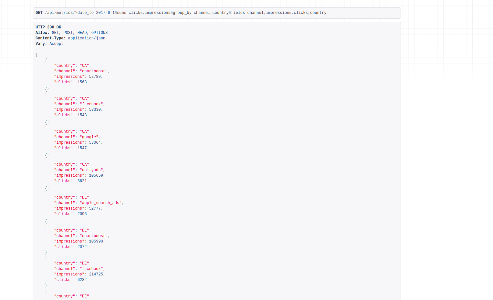

# AdjustAPI

### API to retrieve dataset of performance metrics (impressions, clicks, installs, spend, revenue) for a given date, advertising channel, country and operating system.

## Features:
    1- filter by time range, channels, countries, operating systems
    2- group by one or more columns: date, channel, country, operating system
    3- sort by any column in ascending or descending order
    4- see derived metric CPI (cost per install) which is calculated as cpi = spend / installs

## Initialize your database with fixture:
```
python3 manage.py migrate --run-syncdb
python3 manage.py loaddata initial_role_data.json 
```

## start development server:
```
python3 manage.py runserver
```

## Common API use-cases:
- Show the number of impressions and clicks that occurred before the 1st of June 2017, broken down by channel and country, sorted by clicks in descending order:
```
{IP}:{PORT}/api/metrics/?date_to=2017-6-1&sums=clicks,impressions&group_by=channel,country&fields=channel,impressions,clicks,country
```



- Show the number of installs that occurred in May of 2017 on iOS, broken down by date, sorted by date in ascending order.:
```
{IP}:{PORT}/api/metrics/?date_from=2017-5-1&date_to=2017-5-30&fields=installs,date,os&os=ios&sorty_value=date&sort_direction=asc
```


- Show the number of impressions and clicks that occurred before the 1st of June 2017, broken down by channel and country, sorted by clicks in descending order:
```
{IP}:{PORT}/api/metrics/?date_from=2017-6-1&country=us&fields=revenue,os&sort_value=revenue&sort_direction=desc
```


- Show CPI and spend for Canada (CA) broken down by channel ordered by CPI in descending order:
```
{IP}:{PORT}/api/metrics/?country=ca&fields=cpi,spend,channel&sort_value=cpi&sort_direction=desc
```


- get all data:

```
{IP}:{PORT}/api/metrics/
```